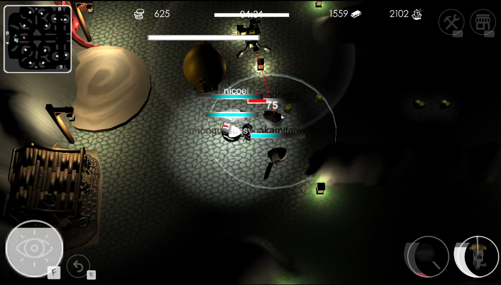
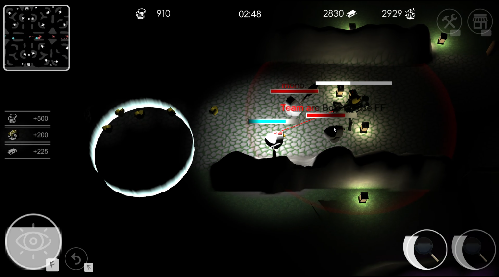
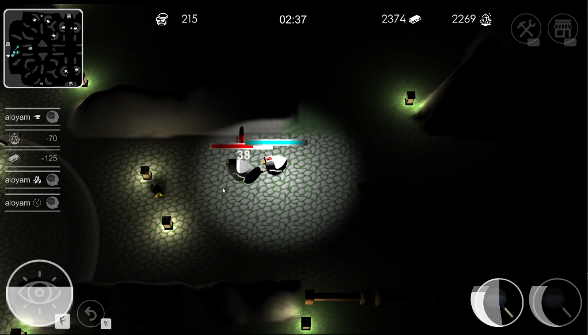
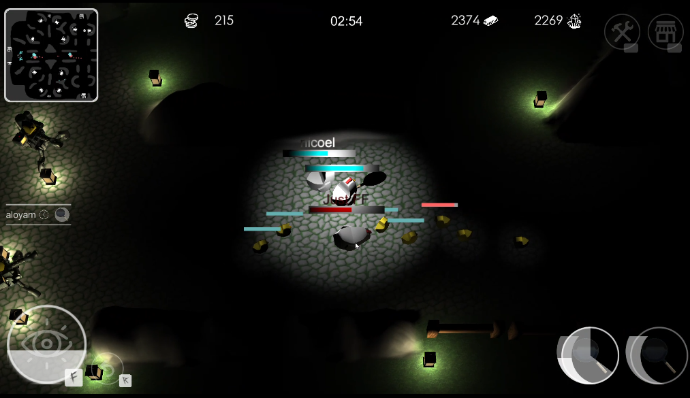
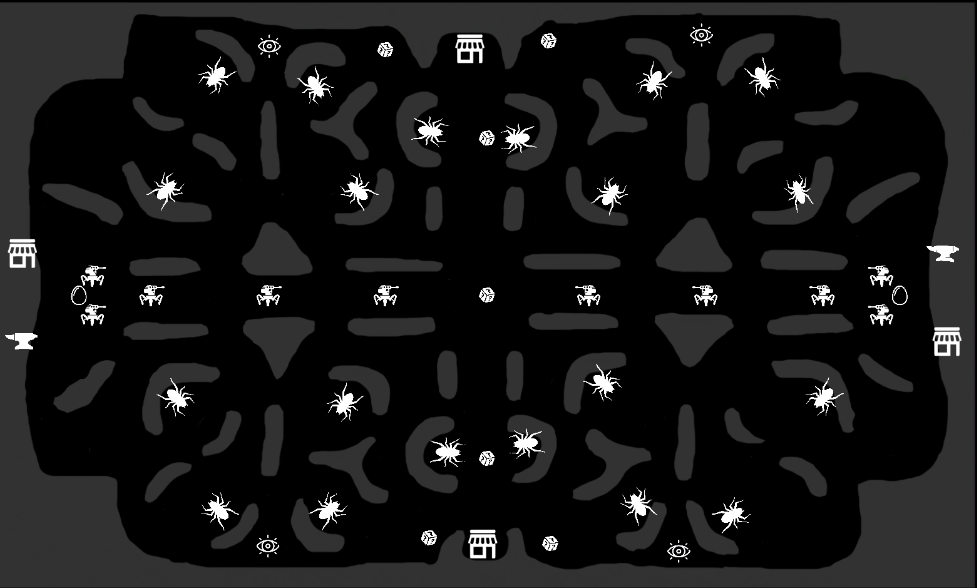

# Chicken Wars
### Details
_Submission for Indepent Work Project module (Nanyang Polytechnic - Game Development & Technology)_    
Developed by: Tan Guan Qun    
Timeline: 3 Months    
Tech Stack: Unity Engine, C#, Photon Bolt (Multiplayer Networking Library)    
### Overview
Chicken Wars is a 2.5/3D Multiplayer (3 v 3, 6 player) MOBA game where players play as chickens and battle to protect their egg crystal while attacking the opposing team's egg crystal!

Gameplay Demo Video: https://www.youtube.com/watch?v=sqO7yeaxA1w

### Gameplay Photos

